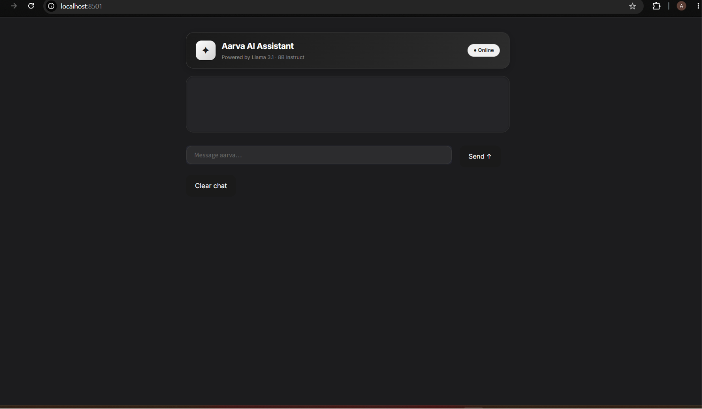
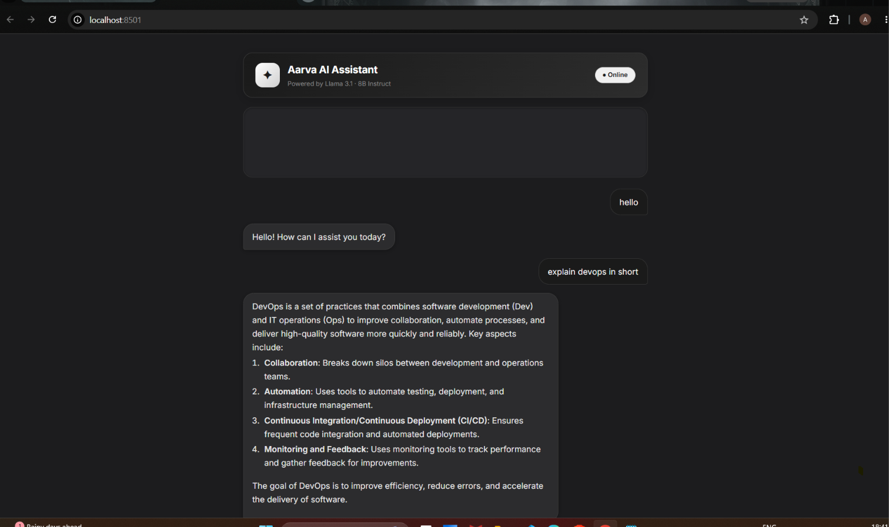

# ✦ Aarva AI Assistant

A sleek AI chatbot built with **Streamlit** and powered by **Meta's Llama 3.1 8B Instruct** model via Hugging Face Inference API.


---

## 🖥️ Preview




---

## ✨ Features

- 💬 Real-time conversational AI powered by Llama 3.1
- 🎨 Dark blackish-gray themed UI 
- 🧠 Full chat history maintained across messages
- 🗑️ One-click clear conversation button
- ⚡ Fast and lightweight 

---

## 🚀 Getting Started

### 1. Clone the repository

```bash
git clone https://github.com/your-username/aarva-ai.git
cd aarva-ai
```

### 2. Install dependencies

```bash
pip install -r requirements.txt
```

### 3. Add your Hugging Face API key

Open `chatBot.py` and replace the API key with your HF Token :

replace at line 134 of `chatBot.py`
```python
client = InferenceClient(api_key="HF_TOKEN")
```

> 🔑 Get your free API key at [huggingface.co/settings/tokens](https://huggingface.co/settings/tokens)

### 4. Run the app

```bash
streamlit run chatbot_app.py
```

Then open your browser at `http://localhost:8501`

---

## 📁 Project Structure

```
aarva-ai/
├── chatbot_app.py      # Main Streamlit app
├── requirements.txt    # Python dependencies
└── README.md           # Project documentation
```

---

## 📦 Requirements

```
streamlit
huggingface_hub
```


---

## 🤖 Model

| Property | Value |
|----------|-------|
| Model | `meta-llama/Llama-3.1-8B-Instruct` |
| Provider | Hugging Face Inference API |
| Max tokens | 300 |


---

## 🙌 Acknowledgements

- [Streamlit](https://streamlit.io/) — for the web framework
- [Hugging Face](https://huggingface.co/) — for the inference API
- [Meta AI](https://ai.meta.com/) — for the Llama 3.1 model
